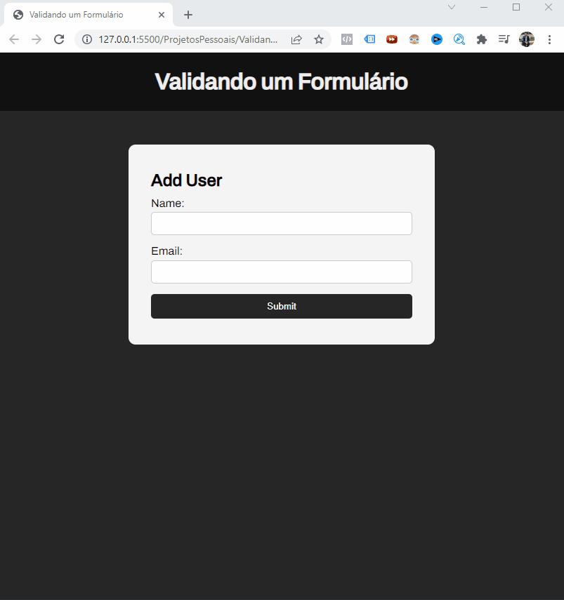

<h1 align="center">Projeto Validando Formulário</h1>

 

Esse projeto foi desenvolvido com HTML + CSS + JAVASCRIPT - Validado o formulário com manipulação do DOM via JS. Observe que se o usuário clicar em submit será enviada uma mensagem para preencher as informações e logo após a mensagem será apagada automaticamente, realizei o setTimeout para validar essa mensagem de error. Após isso que o usuário adicionar o nome e emails será criado uma lista abaixo com as informações enviadas, e também será apagado as informações do formulário para adicionar novamente.

  

<h1 align="center">
    
</h1>

 

### 🛠 Tecnologias

As seguintes ferramentas foram usadas na construção do Projeto: 

- [JavaScript](https://developer.mozilla.org/pt-BR/docs/Web/JavaScript)
- [VSCode](https://code.visualstudio.com/)
- [HTML](https://developer.mozilla.org/pt-BR/docs/Web/HTML) 
- [CSS](https://developer.mozilla.org/pt-BR/docs/Web/CSS)

---

Feito com 🤩 by Wires Teles 😎 [Veja meu Linkedin](https://www.linkedin.com/in/wires-teles-javascript-dev/)